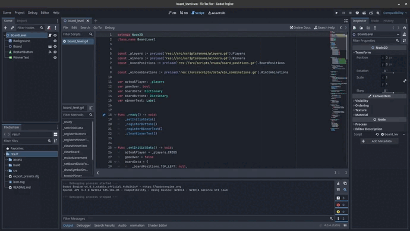

# TIC TAC TOE

A simple tic tac toe game with a simple pixel art.

**OBS: It's my first game. 😁**

This game was made with Godot Engine 4.0 Standar Version, you can download this version here: https://godotengine.org/download/archive/.

After this you just need to open this project in Godot and start with F5.

This game can be compiled to run on Android to, it's developed thinking in the mobile devices dimensions.
